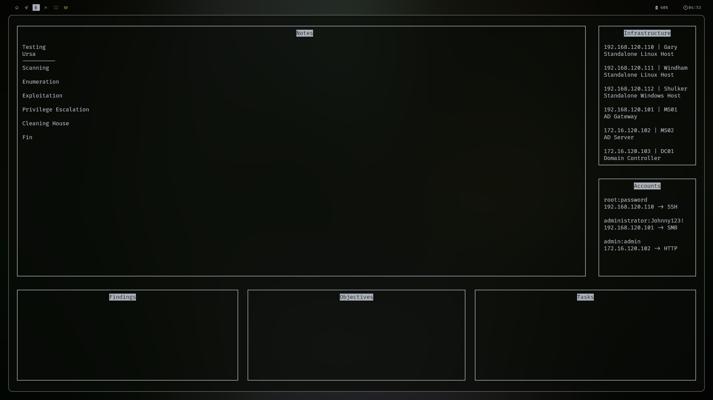
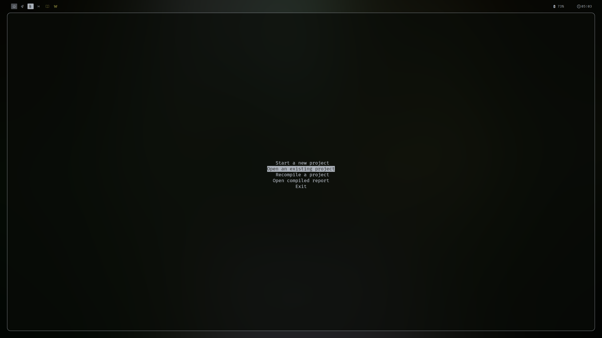
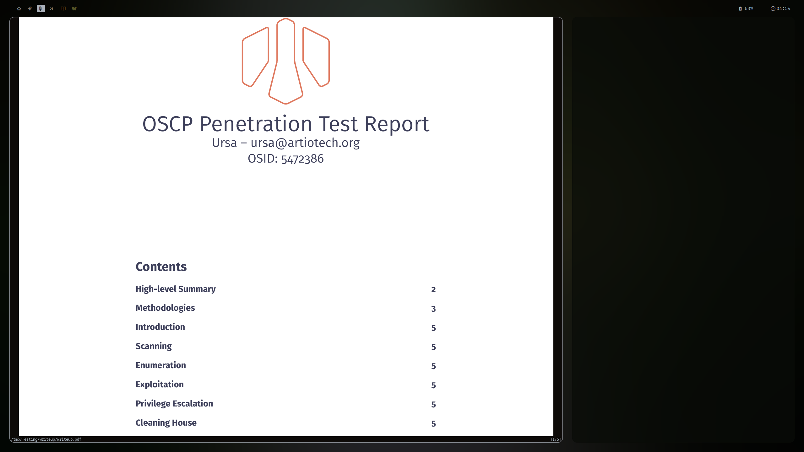

# Bristlecone
Documenting utility to track CTF/Red Team engagements in the terminal.



## Installation
```bash
git clone https://github.com/Apis-Carnica/Bristlecone.git
cd Bristlecone
pip install -r requirements.txt
```

## Usage
```bash
python bristlecone.py
```




## Features
- [x] Doesn't work!
- [x] Create OSCP-acceptable reports
- [x] Track CTF/Red Team engagements
- [x] Add, edit, and delete engagements
- [x] Comprehensive terminal UI
- [x] Automatically save engagements and notes
- [x] Save time creating write-ups

## Roadmap
- [ ] Add support for multiple types of engagements
- [ ] Add support for user-defined fields
- [ ] Add support for multiple users to collaborate on engagements
- [ ] Add support for exporting engagements to other formats

## License
This project is licensed under the MIT License - see the [LICENSE](LICENSE) file for details.
